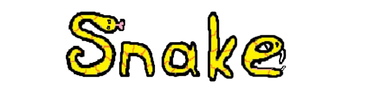
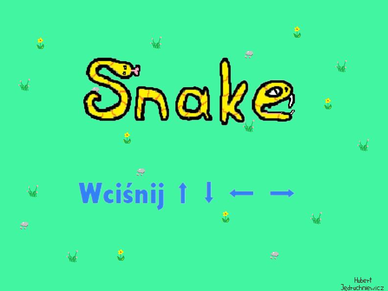
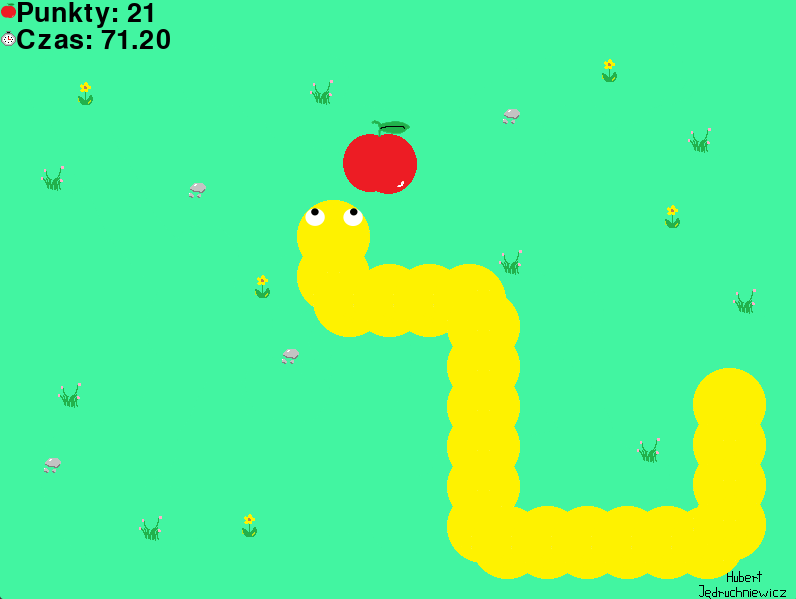
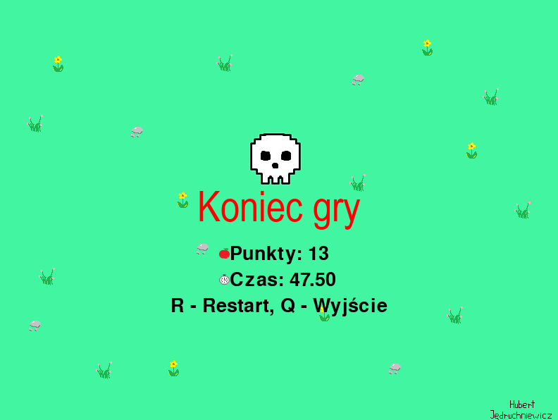

# Snake - Pygame Project

  

## Table of Contents
- 🚀 [Project Overview](#project-overview)
- ✨ [Features](#features)
- 💻 [Technologies](#technologies)
- 📋[Requirements](#requirements)
- 🛠️ [Setup Instructions](#setup-instructions)
- 📸 [Screenshots](#screenshots)

## Project Overview
**Snake** is a simple game written in Python using the Pygame library. However, it's not a typical version of this type of gameplay. This is my first project involving the creation of a 2D game. 
> [!NOTE]  
> The game is only available in the Polish language version!

## Features
The snake's movement grid is not rigidly fixed, allowing the player to move freely across every pixel of the board. Other than that, it's just Snake! Earn as many points as possible by collecting apples while avoiding collisions with the map boundaries and your own body.

## Technologies

- Python 3.10 using the Pygame library

## Requirements
Any system capable of running .exe files.

## Setup Instructions

1. Extract the `Snake.zip` file.
2. Run the `snake.exe` file to start the game.

## Screenshots

  
  
  

